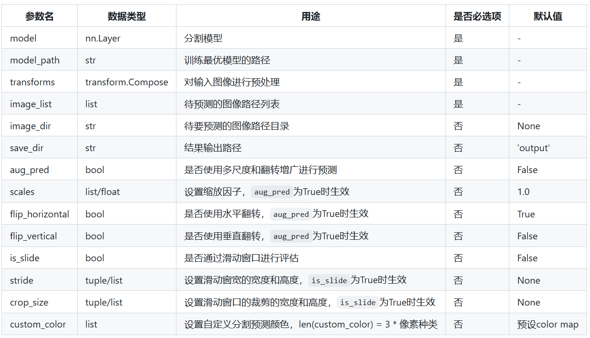

# 1.数据集准备
## 1.1分割标签要求
①PaddleSeg使用单通道的标注图片，每一种像素值代表一种类别，像素标注类别需要从0开始递增，例如0，1，2，3表示有4种类别  
②可以使用代码./py/show_mask查看mask图及其像素点分布统计
## 1.2公共数据集处理
### 1.2.1图片裁剪
有的遥感数据集里面的图片都是几千*几千的像素大小，不利于直接送入模型训练，因此我们需要对原图和标签进行裁剪成小图  
使用py文件夹中如下两个代码可以进行此项工作
```
cut_img.py
cut_label.py
```
### 1.2.2数据集标签转换
一般公共数据集我们不能拿来直接使用原因有如下两点：
1. 公共数据集的标签不一定都是我们需要的（如下面所示），我们可能只需要其中几类
```
land_cover_types = {
    1: "industrial area",
    2: "paddyfield",
    3: "irrigated field",
    4: "dry cropland",
    5: "garden land",
    6: "arbor forest",
    7: "shrub forest",
    8: "park",
    9: "natural meadow",
    10: "artificial meadow",
    11: "river",
    12: "urban residential",
    13: "lake",
    14: "pond",
    15: "fish pond",
    16: "snow",
    17: "bareland",
    18: "rural residential",
    19: "stadium",
    20: "square",
    21: "road",
    22: "overpass",
    23: "railway station",
    24: "airport",
    0: "unlabeled"
}
```
2. 有时候我们训练时可能会融合好几个数据集，但是不同数据集中对同一个物体的标注可能不同。如：有的数据集中对水体标注用的是1，而有的用的是2，那么我们拿到一起训练的时候就需要统一来  

使用py中的如下代码可以对数据集的mask的像素按照自己的预期进行修改：
```
convert_mask_label.py
```


## 1.3数据集文件摆放
①按下面的文件结构来放置图片和标签,原图用jpg，标签用png 
```
    custom_dataset  
    |  
    |--images           # 存放所有原图  
    |  |--image1.jpg  
    |  |--image2.jpg  
    |  |--...
    |  
    |--labels           # 存放所有标注图  
    |  |--label1.png  
    |  |--label2.png  
    |  |--...  
```
## 1.4使用代码生成txt数据读取文件
```
python tools/data/split_dataset_list.py <dataset_root> <images_dir_name> <labels_dir_name> ${FLAGS}
```
各个参数的含义如下：
+ dataset_root: 数据集根目录  
+ images_dir_name: 原始图像目录名  
+ labels_dir_name: 标注图像目录名  
  
示例  
```
python tools/data/split_dataset_list.py <dataset_root> images labels --split 0.6 0.2 0.2 --format jpg png
```
## 1.5处理后的结果如下
```
custom_dataset
    |
    |--images
    |  |--image1.jpg
    |  |--image2.jpg
    |  |--...
    |
    |--labels
    |  |--label1.png
    |  |--label2.png
    |  |--...
    |
    |--train.txt
    |
    |--val.txt
    |
    |--test.txt
```

# 2.准备配置文件yaml
## 2.1官方参数解释例子
官方以PaddleSeg/configs/quick_start/pp_liteseg_optic_disc_512x512_1k.yml配置文件为例
```
batch_size: 4  #设定batch_size的值即为迭代一次送入网络的图片数量，一般显卡显存越大，batch_size的值可以越大。如果使用多卡训练，总得batch size等于该batch size乘以卡数。
iters: 1000    #模型训练迭代的轮数

train_dataset:  #训练数据设置
  type: Dataset #指定加载数据集的类。数据集类的代码在`PaddleSeg/paddleseg/datasets`目录下。
  dataset_root: data/optic_disc_seg #数据集路径
  train_path: data/optic_disc_seg/train_list.txt  #数据集中用于训练的标识文件
  num_classes: 2  #指定类别个数（背景也算为一类）
  mode: train #表示用于训练
  transforms: #模型训练的数据预处理方式。
    - type: ResizeStepScaling #将原始图像和标注图像随机缩放为0.5~2.0倍
      min_scale_factor: 0.5
      max_scale_factor: 2.0
      scale_step_size: 0.25
    - type: RandomPaddingCrop #从原始图像和标注图像中随机裁剪512x512大小
      crop_size: [512, 512]
    - type: RandomHorizontalFlip  #对原始图像和标注图像随机进行水平反转
    - type: RandomDistort #对原始图像进行亮度、对比度、饱和度随机变动，标注图像不变
      brightness_range: 0.5
      contrast_range: 0.5
      saturation_range: 0.5
    - type: Normalize #对原始图像进行归一化，标注图像保持不变

val_dataset:  #验证数据设置
  type: Dataset #指定加载数据集的类。数据集类的代码在`PaddleSeg/paddleseg/datasets`目录下。
  dataset_root: data/optic_disc_seg #数据集路径
  val_path: data/optic_disc_seg/val_list.txt  #数据集中用于验证的标识文件
  num_classes: 2  #指定类别个数（背景也算为一类）
  mode: val #表示用于验证
  transforms: #模型验证的数据预处理的方式
    - type: Normalize #对原始图像进行归一化，标注图像保持不变

optimizer: #设定优化器的类型
  type: SGD #采用SGD（Stochastic Gradient Descent）随机梯度下降方法为优化器
  momentum: 0.9 #设置SGD的动量
  weight_decay: 4.0e-5 #权值衰减，使用的目的是防止过拟合

lr_scheduler: # 学习率的相关设置
  type: PolynomialDecay # 一种学习率类型。共支持12种策略
  learning_rate: 0.01 # 初始学习率
  power: 0.9
  end_lr: 0

loss: #设定损失函数的类型
  types:
    - type: CrossEntropyLoss  #CE损失
  coef: [1, 1, 1] # PP-LiteSeg有一个主loss和两个辅助loss，coef表示权重，所以 total_loss = coef_1 * loss_1 + .... + coef_n * loss_n

model:  #模型说明
  type: PPLiteSeg  #设定模型类别
  backbone:  # 设定模型的backbone，包括名字和预训练权重
    type: STDC2
    pretrained: https://bj.bcebos.com/paddleseg/dygraph/PP_STDCNet2.tar.gz

```
注意：
* 对于训练和测试数据集的预处理，PaddleSeg默认会添加读取图像操作、HWC转CHW的操作，所以这两个操作不用添加到transform配置字段中。
* 只有"PaddleSeg/configs/quick_start"下面配置文件中的学习率为单卡学习率，其他配置文件中均为4卡的学习率。如果大家单卡训练来复现公开数据集上的指标，学习率设置应变成原来的1/4。

## 2.2 自己修改配置文件
我们使用的网络是hrnet+ocrnet

```
batch_size: 4
iters: 40000

train_dataset:
  type: Dataset #因为是自定义数据集，所以需要选这个，数据读取格式，只要按照上面的方法来制作数据集
  dataset_root: data/my_data
  train_path: data/my_data/train.txt
  num_classes: 8  #类别个数，背景也算一类
  transforms:
    - type: ResizeStepScaling
      min_scale_factor: 0.5
      max_scale_factor: 2.0
      scale_step_size: 0.25
    - type: RandomPaddingCrop
      crop_size: [1024, 1024]
    - type: RandomHorizontalFlip
    - type: RandomDistort
      brightness_range: 0.4
      contrast_range: 0.4
      saturation_range: 0.4
    - type: Normalize
  mode: train

val_dataset:
  type: Dataset
  dataset_root: data/my_data
  val_path: data/my_data/val.txt
  num_classes: 8  #类别个数，背景也算一类
  transforms:
    - type: Padding
      target_size: [1024, 1024]
    - type: Normalize
  mode: val


optimizer:
  type: SGD
  momentum: 0.9
  weight_decay: 4.0e-5

lr_scheduler:
  type: PolynomialDecay
  learning_rate: 0.01
  end_lr: 0
  power: 0.9

loss:
  types:
    - type: CrossEntropyLoss
    - type: CrossEntropyLoss
  coef: [1,1]  #如果设置呢多个损失函数可以设置每个损失的权重

model:
  type: OCRNet
  backbone:
    type: HRNet_W48
    pretrained: https://bj.bcebos.com/paddleseg/dygraph/hrnet_w48_ssld.tar.gz
  backbone_indices: [0]
```
# 3.开始训练
## 3.1 训练
准备好配置文件后，我们使用tools/train.py脚本进行模型训练。
```
export CUDA_VISIBLE_DEVICES=0 # Linux上设置1张可用的卡,多卡就设置几个显卡的id
# set CUDA_VISIBLE_DEVICES=0  # Windows上设置1张可用的卡

python tools/train.py \
       --config my_configs/my_ocrnet.yml \
       --do_eval \
       --use_vdl \
       --save_interval 500 \
       --save_dir output
```
train.py脚本输入参数的详细说明如下:

## 3.2训练过程可视化
当train.py脚本设置use_vdl输入参数后，PaddleSeg会将训练过程中的日志信息写入VisualDL文件，写入的日志信息包括：  
* loss
* 学习率lr
* 训练时间
* 数据读取时间
* 验证集上mIoU（当打开了do_eval开关后生效）
* 验证集上mean Accuracy（当打开了do_eval开关后生效）

# 4.模型评估
## 4.1 训练完后的文件夹结构
训练完成后的输出文件夹格式如下，包括每隔多少步数保存的权重参数和优化器参数，可以方便模型进行断点续训  
例如：我们可以使用以下代码对模型进行继续训练：  
```
python tools/train.py \
       --config my_configs/my_ocrnet.yml \
       --resume_model output/iter1000  \
       --do_eval \
       --use_vdl \
       --save_interval 500 \
       --save_dir output
```

```
output
  ├── iter_500          #表示在500步保存一次模型
    ├── model.pdparams  #模型参数
    └── model.pdopt     #训练阶段的优化器参数
  ├── iter_1000         #表示在1000步保存一次模型
    ├── model.pdparams  #模型参数
    └── model.pdopt     #训练阶段的优化器参数
  └── best_model        #精度最高的模型权重
    └── model.pdparams  
```
## 4.2 模型评估
在图像分割领域中，评估模型质量主要是通过三个指标进行判断，准确率（acc）、平均交并比（Mean Intersection over Union，简称mIoU）、Kappa系数。
我们使用如下代码可以对训练好的权重进行评估：
```
python tools/val.py \
       --config my_configs/my_ocrnet.yml \
       --model_path output/best_model/model.pdparams \
       --is_slide \
       --crop_size 256 256 \
       --stride 128 128
```
评估函数可以传入各种参数，各个参数含义如下：  

# 5.模型推理
tools/predict.py脚本是专门用来可视化预测的，命令格式如下所示。
```
python tools/predict.py \
       --config my_configs/my_ocrnet.yml \
       --model_path output/best_model/model.pdparams \
       --image_path dataset/**.jpg \
       --save_dir output/result
```
预测函数可以传入各种参数，各个参数含义如下：  

# 6.模型部署
